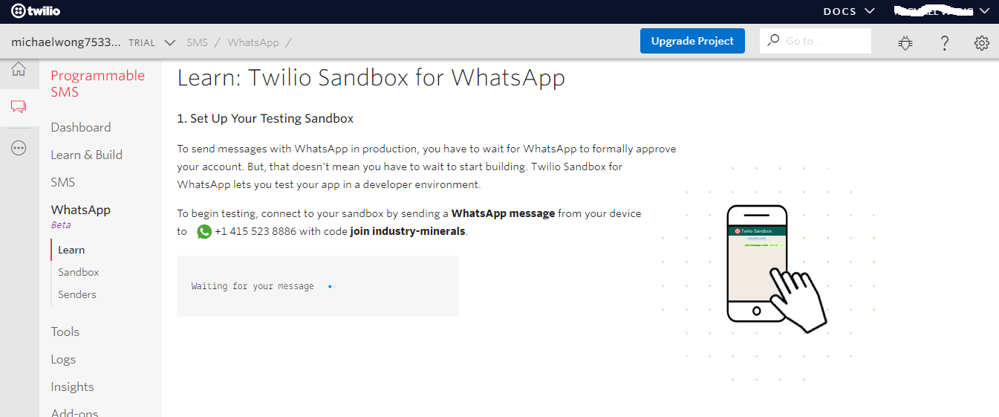
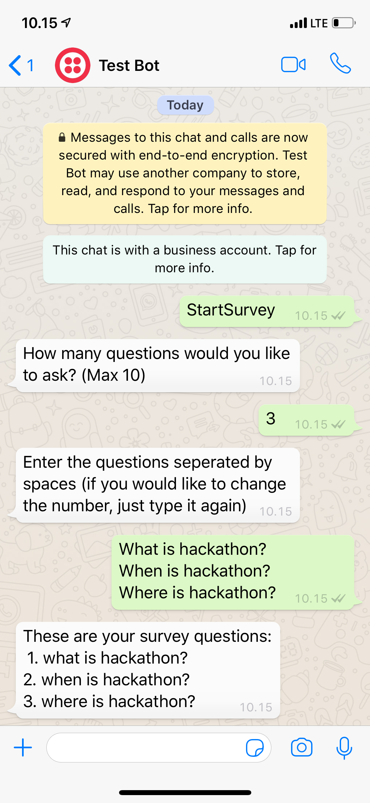
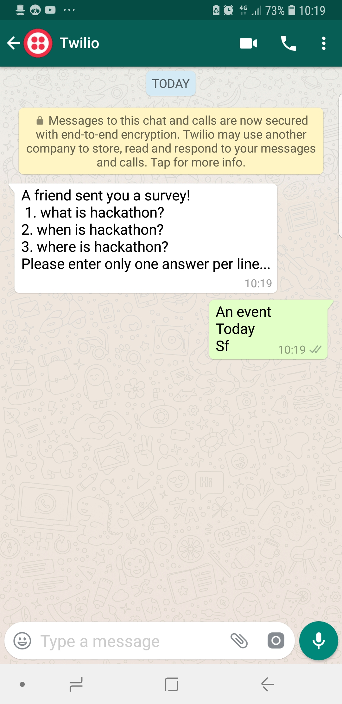
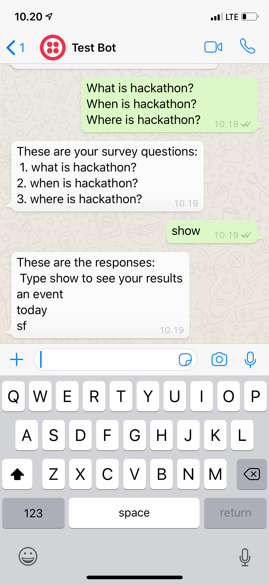

# WhatsAppSurveyBot
A bot that helps create a survey and send that survey to other people through whatsapp and integrated with AI to analyze positive or negative responses
# Installation
Install dependencies
```sh
1. npm i Express
2. npm i Body Parser
3. npm i Twillio
```
# Usage
Input phone number to the person who want to send your survey to
```sh
[Line 85]... whatsapp:+XXXXXXXXXX ... 
```
Make a whatsapp sandbox in twillio, click [this link](https://www.twilio.com/docs/sms/whatsapp/api) and Invite the person to the sandbox



To start the survey, type 
```sh
  StartSurvey
  ```

 
 # This is the response

 
 # This is how you take the result

 
 # Machine Learning Model
 > Predicting sentiment text from survey input
 
 
 [Code for machine learning](https://github.com/sodagembira/SFHacks2019_TwillioSubmission_WhatsAppSurveyBot/blob/master/MachineLearning.py)
 
 Libraries used
 
 ```sh
 pip install pandas
 pip install sklearn
 ```

 Havent integrated the AI model to the bot in yet (from python to nodejs)
